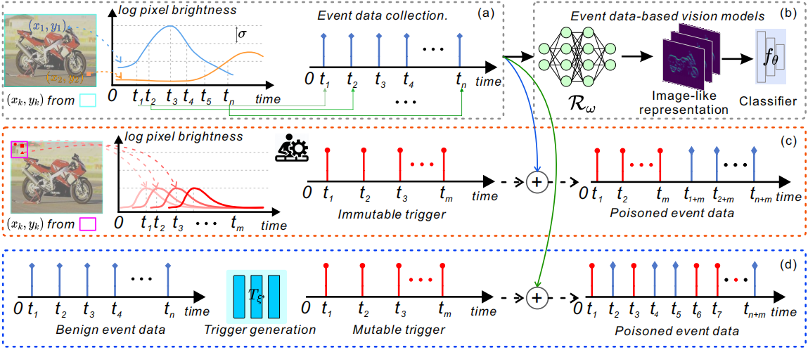

# Event Trojan

[](https://github.com/rfww/EventTrojan)

This repository is the officially implemented event trojan 
described in Wang et al. ECCV'24. 
The paper can be found [here](https://drive.google.com/file/d/1kry5kpW4cRJoT6AxfQk0HSceEM5_jUSG/view?usp=sharing). Due to its large file size, reviewing the paper on [arXiv](https://arxiv.org/pdf/2407.06838) is quite slow.

If you use this code in an academic context, please cite the following work:

[Ruofei Wang](https://scholar.google.com/citations?user=wy_5cK8AAAAJ&hl=zh-CN), Qing Guo,Haoliang Li, Renjie Wan, 
"Event Trojan: Asynchronous Event-based Backdoor Attacks", 
The European Conference on Computer Vision (ECCV), 2024.


```bibtex
@InProceedings{Wang_2024_ECCV,
  author = {Ruofei Wang and Qing Cuo and Haoliang Li and Renjie Wan},
  title = {Event Trojan: Asynchronous Event-based Backdoor Attacks},
  booktitle = {Euro. Conf. Comput. Vis. (ECCV)},
  month = {September},
  year = {2024}
}
```

## Requirements

* Python 3.6.13
* anaconda
* cuda 11.1
* torch 1.10.1
* torchvision 0.11.2

## Dependencies
Create a conda environment with `python3.6` and activate it:

    conda create -n event_trojan python=3.6
    coinda activate event_trojan

Install all dependencies by calling:

    pip install -r requirements.txt
   
## Training
Before training, download the `N-Caltech101` and `N-Cars` datasets and unzip them:

    wget http://rpg.ifi.uzh.ch/datasets/gehrig_et_al_iccv19/N-Caltech101.zip 
    unzip N-Caltech101.zip

    # https://www.prophesee.ai/2018/03/13/dataset-n-cars  (N-Cars)
    
Then start training by calling

    python main_iet.py --training_dataset N-Caltech101/training/ --validation_dataset N-Caltech101/validation/ --log_dir log/iet --device cuda:0

Here, `training_dataset` and `validation_dataset` should point to the folders where the training and validation sets are stored.
`log_dir` controls logging and `device` controls on which device you want to train. Checkpoints and models with lowest validation loss will be saved in the root folder of `log_dir`.


### Additional parameters 
* `--num_worker` how many threads to use to load data
* `--pin_memory` whether to pin memory or not
* `--num_epochs` number of epochs to train
* `--save_every_n_epochs` save a checkpoint every n epochs.
* `--batch_size` batch size for training

### Visualization

Training can be visualized by calling tensorboard:

    tensorboard --logdir log/iet

Training and validation losses as well as classification accuracies are plotted. 

## Testing
Once trained, the models can be tested by calling the following script:

    python testing_iet.py

Which will print the test score after iteration through the whole dataset. ASR and CDA can be evaluated with the poison ratio by 1.0 and 0.0, respectively.

    
*Details about the used event representations in our paper can be found at (https://github.com/uzh-rpg/rpg_event_representation_learning), (https://github.com/LarryDong/event_representation). Thanks them.*
